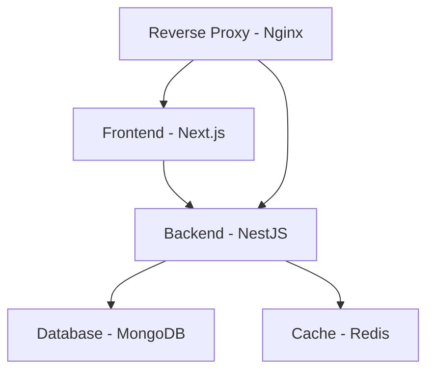

# Cloud-Based Admin Publication System

## Project Overview
A scalable cloud application enabling administrators to manage publications and perform CRUD operations through a microservices architecture.

## 📌 Team
| Member                        | Role                          |
|-------------------------------|-------------------------------|
| César Álvaro Miranda Gutiérrez | Computer Science Engineer     |
| Mirko Cliver Rodríguez Poveda  | Telecommunications Engineer    |

**Academic Year:** 2025  
**Faculty:** Technology and Science  

## 🏗️ System Architecture


## 🏗️ System Architecture
The system is built using a microservices approach with the following components:

| Component              | Technology    | Container |
|------------------------|--------------|-----------|
| Frontend               | Next.js      | 1         |
| Backend API            | Node.js + NestJS | 2 |
| Database               | MongoDB      | 3         |
| Cache                  | Redis        | 4         |
| Reverse Proxy          | Nginx        | 5         |

## 🚀 Installation Guide

### Prerequisites
- Node.js v18+
- npm or yarn
- Docker (optional for container deployment)
- MongoDB instance
- Redis server

### 🛠️ Backend Setup

```bash
# Install NestJS CLI globally
npm install -g @nestjs/cli

# Create new project
nest new backend
cd backend

# Install core dependencies
npm install @nestjs/mongoose mongoose @nestjs/config @nestjs/jwt passport passport-jwt bcrypt redis class-validator class-transformer @nestjs/swagger swagger-ui-express

# Install development dependencies
npm install --save-dev @types/passport-jwt @types/bcrypt
```
### 🛠️ deploy in docker with nginx reverse proxy

```bash
# 
cd backend

# Create image and deploy container
docker-compose up

# Show logs
docker-compose logs


